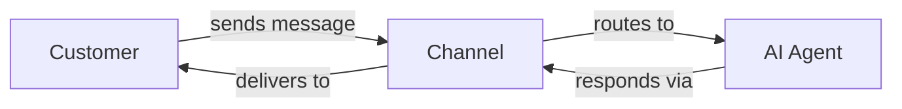

You've created, trained, and tested your AI agent. Now it's time to connect it with your customers.

**Channels** are the communication pathways between your AI agent and your customers. Each channel lets customers reach your AI agent through a different platform.

## Available Channels

<CardGroup cols={3}>
  <Card title="Live Chat" icon="comments" href="/channels/live-chat">
    Embed a chat widget directly on your website for instant customer support.
  </Card>
  <Card title="WhatsApp" icon="whatsapp" href="/channels/whatsapp">
    Connect via Twilio to support customers on WhatsApp.
  </Card>
  <Card title="SMS" icon="message-sms" href="/channels/sms">
    Connect via Twilio to handle customer inquiries over text message.
  </Card>
</CardGroup>

## How Channels Work

1. A customer sends a message through a channel (e.g., your website chat widget)
2. The channel routes the message to your AI agent
3. Your AI agent processes the message and generates a response
4. The response is delivered back to the customer through the same channel

## Choosing a Channel

| Channel | Best For | Setup Complexity |
|---------|----------|------------------|
| **Live Chat** | Website visitors, e-commerce | Simple—add a code snippet |
| **WhatsApp** | International customers, mobile-first users | Requires Twilio account |
| **SMS** | Transactional updates, customers without apps | Requires Twilio account |

<Tip>
  Start with **Live Chat** to get your AI agent in front of customers quickly. Add WhatsApp or SMS later to expand your reach.
</Tip>

## Next Steps

<CardGroup cols={2}>
  <Card title="Set Up Live Chat" icon="arrow-right" href="/channels/live-chat">
    Add a chat widget to your website in minutes.
  </Card>
  <Card title="Configure WhatsApp" icon="arrow-right" href="/channels/whatsapp">
    Connect your Twilio account for WhatsApp messaging.
  </Card>
</CardGroup>

