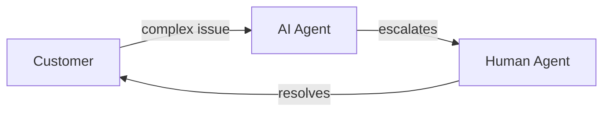

Sometimes your AI agent can't fully resolve a customer's issue. Escalations let you seamlessly transfer conversations to human agents in real-time.

## How Escalations Work

1. A customer asks a question the AI agent can't answer
2. The AI agent offers to connect them with a human
3. The conversation is transferred to your support team
4. The human agent picks up with full conversation context
5. The human agent responds directly in their platform (e.g., Zendesk)
6. SupportUnicorn automatically routes the response back to the customer

<Info>
  **No workflow changes for your team.** Human agents work entirely within their existing platform. SupportUnicorn handles all the routing automatically—messages from the customer appear in Zendesk, and replies are delivered back through the original channel (chat, WhatsApp, SMS). Your support team doesn't need to learn new tools or change how they work.
</Info>

## Supported Platforms

<CardGroup cols={2}>
  <Card title="Zendesk" icon="headset" href="/escalations/zendesk">
    Route escalations to your Zendesk support queue with full conversation history.
  </Card>
  <Card title="More Coming Soon" icon="clock">
    We're adding support for additional platforms. Contact us if you have a specific request.
  </Card>
</CardGroup>

## When Escalations Trigger

Escalations can happen in several scenarios:

| Trigger | Description |
|---------|-------------|
| **Customer request** | Customer explicitly asks to speak with a human |
| **Low confidence** | AI agent isn't confident in its response |
| **Sensitive topics** | Configured topics that require human handling |
| **Failed actions** | An action fails and requires human intervention |

## Benefits

<AccordionGroup>
  <Accordion title="Seamless handoff">
    Customers don't need to repeat themselves—human agents receive the full conversation history.
  </Accordion>
  <Accordion title="Reduced wait times">
    AI handles simple questions instantly, freeing human agents for complex issues.
  </Accordion>
  <Accordion title="24/7 availability">
    AI agent provides immediate responses even outside business hours, then escalates when humans are available.
  </Accordion>
</AccordionGroup>

<Tip>
  Review escalated conversations regularly to identify gaps in your AI agent's training. Common escalation reasons often reveal content you should add.
</Tip>

## Get Started

<Card title="Set Up Zendesk Integration" icon="arrow-right" href="/escalations/zendesk">
  Connect your Zendesk account to start routing escalations to your support team.
</Card> 

